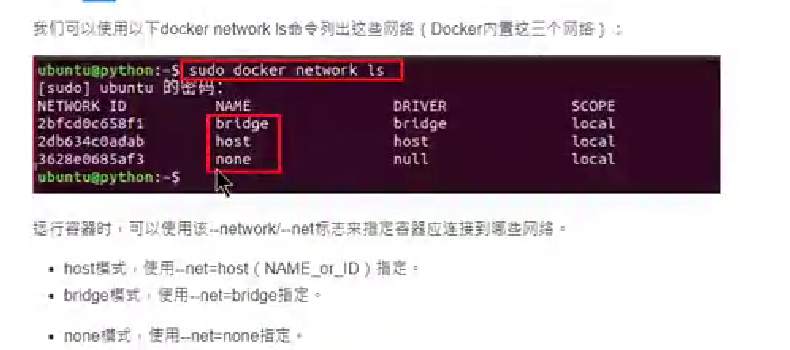

# 补充笔记

## 网络

默认情况下，省器和宿主机之间网络是隔离的，我们可以通过端口映射的方式，将容器中的端口，映射到宿主机的某个端口上·这样我们就可以通过宿主机的ip+port的方式来访同容舞里的内容
### 端口映射方式
1. 端口映射的方式
   1. 随机映射:用`-P`参数来随机ip和端口
      1. 
   2. 指定映射: 就是用`docker run -p 8801:8801`参数来指定映射的端口
   3. 指定ip,随机端口
   4. 

### 网络模式
在进行docker run nginx 的时候会对容器进行一个默认网络设置
那Docker都有环些网招机式呢?Dockar有以下网络摄式:
1. host模式。
2. bridge模式 --- (默认)
3. none模式

我们可以使用以下`docker network ls` 列出这些网络(Docker内置这三个网络):


#### Host

容器直接使用主机的网络命名空间，不进行网络隔离。
`docker run -d --name app2 --net host myapp:v1  # 容器内8080端口直接使用主机8080端口`

原理：

容器与主机共享网络栈（IP 地址、端口、网卡等），容器内的服务直接使用主机的 IP 和端口，无需端口映射。

特点: 
- 容器没有独立的 IP，与主机共用 IP 地址；
- 容器内的端口直接暴露在主机上，无需 -p 映射（但可能与主机端口冲突）；
- 网络性能最优（无桥接转发开销），但安全性和隔离性较差

适用场景: 对网络性能要求极高的场景（如高并发服务），或需要直接使用主机网络配置的场景。

#### bridge

- 类似虚拟机中的NAT模式

Docker 会创建一个名为 docker0 的虚拟网桥（类似交换机），所有使用桥接模式的容器会连接到这个网桥，并分配独立的私有 IP 地址（如 172.17.x.x）。容器通过网桥与主机、其他容器通信

- 特点
  - 容器拥有独立的网络命名空间（网络环境隔离）；
  - 需通过 -p 或 -P 手动映射端口，才能从主机或外部访问容器内服务；
  - 同一主机上的容器可通过容器名或 IP 相互访问（需配置 --link 或自定义网络）

#### none
容器没有网卡、IP、路由，无法与外部通信，仅能在容器内部运行纯离线任务

`docker run -it --net none busybox  # 容器内无网络连接`

适用场景：

不需要网络的离线任务（如数据处理、文件转换）。


#### 自定义网络
1. 假如创建了自定义网络名字为db
2. 原理：Docker 的内置 DNS 解析
   1. 当 Web 容器尝试连接db:3306时，Docker 的 DNS 服务会自动将db解析为该容器在app-net网络中的私有 IP（如172.18.0.2）；
   2. 解析过程完全由 Docker 内部完成，无需手动配置 hosts 或 DNS 服务器；
   3. 只有同一自定义网络内的容器才能通过容器名互访，默认的bridge网络（非自定义）需要额外配置才能支持容器名解析

```
关键指令详解：
docker network ls

列出当前 Docker 环境中所有的网络，包括默认网络（bridge、host、none）和自定义网络。
示例输出包含网络 ID、名称、驱动类型（bridge/host等）和是否被使用。

docker network create

创建自定义网络，默认使用 bridge 驱动（最常用）。
自定义网络的优势：同一网络内的容器可通过容器名直接通信（无需--link），隔离性更好。
例如：创建一个名为 app-network 的网络，供多个服务容器互联。

docker network inspect <网络名>

查看网络的详细配置，包括：
网络的 IP 地址范围、网关；
已连接的容器列表及它们的 IP 地址；
网络模式、驱动等信息。
常用于排查容器网络连接问题。

docker network connect/disconnect
connect：将运行中的容器加入指定网络（一个容器可加入多个网络）。
disconnect：将容器从网络中移除，移除后容器无法再通过该网络与其他容器通信。

docker network prune
批量删除所有 “未被容器使用” 的网络（包括自定义网络），释放资源，建议定期清理。
```